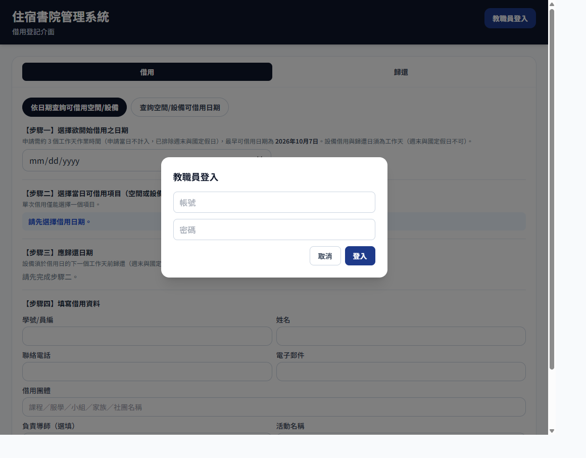
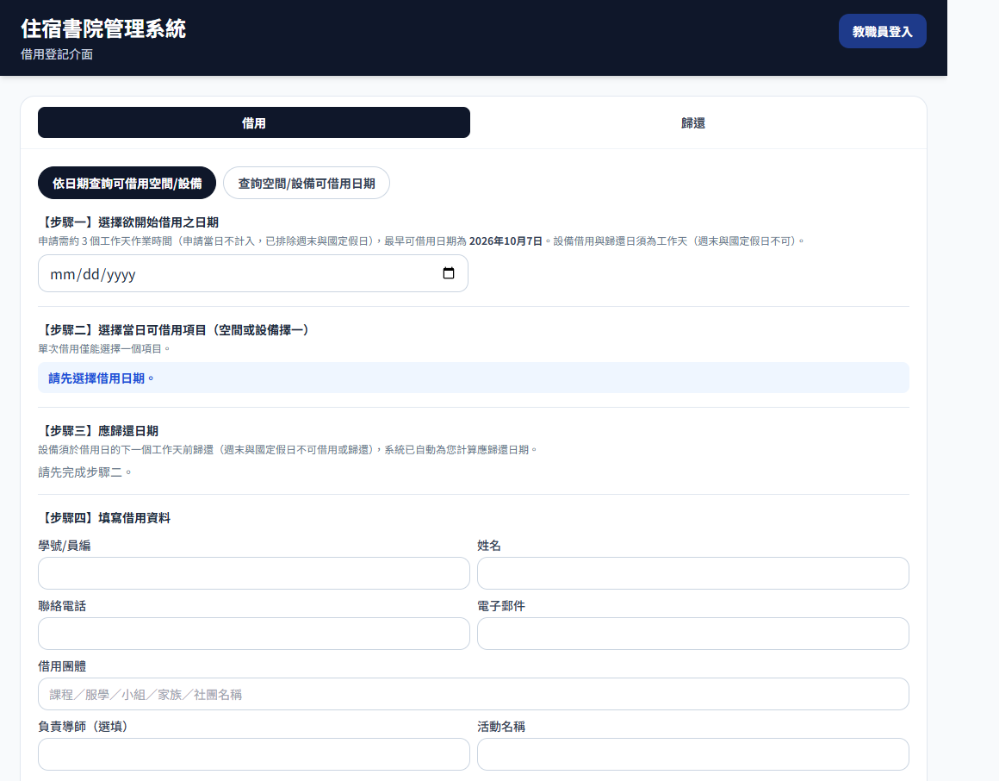
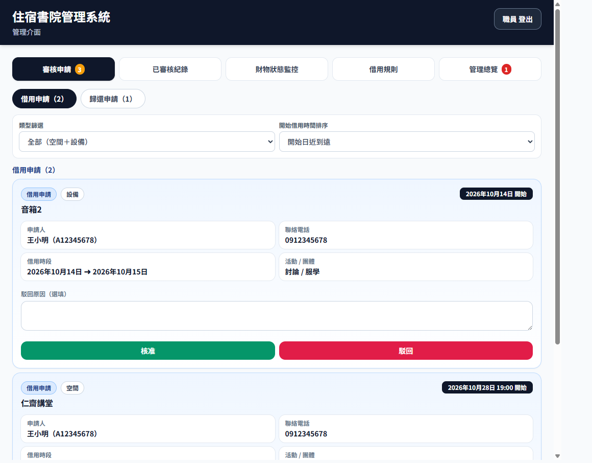
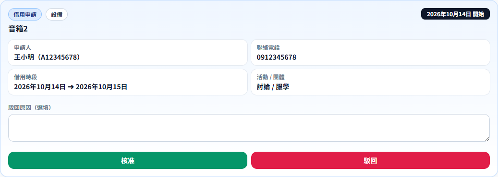
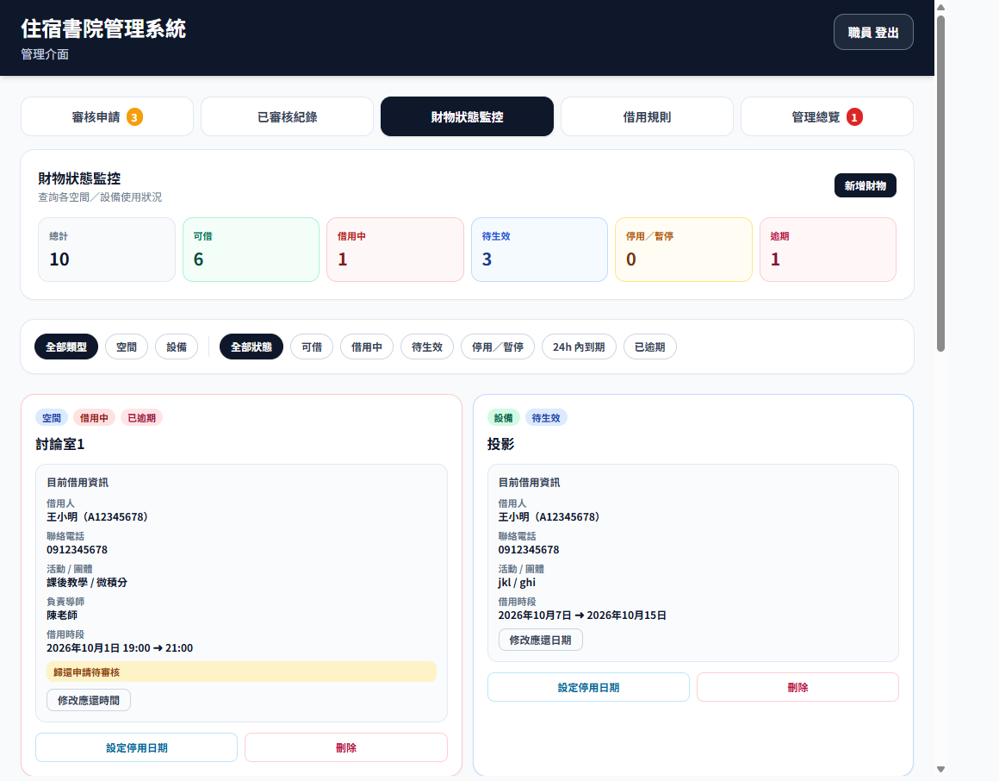
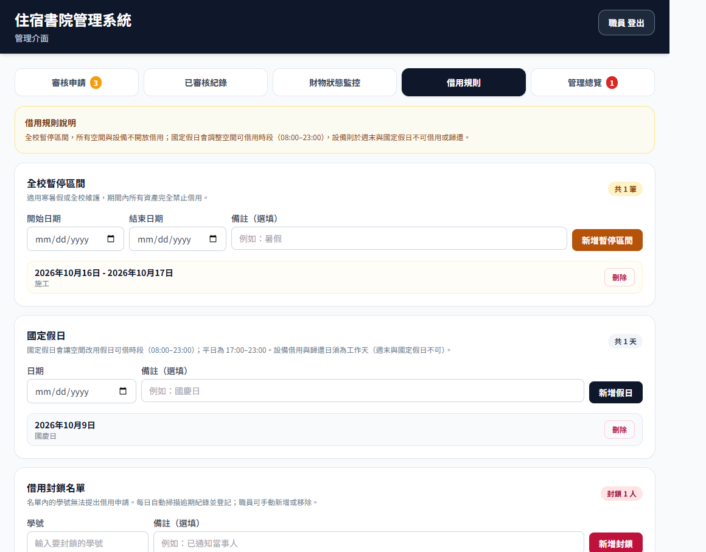

# 住宿書院管理系統　操作手冊

文中的「」是畫面上會看到的按鈕或文字，請照著點。

本手冊說明學生怎麼借、怎麼還，以及職員登入後每一項功能怎麼操作。

---

## 目錄

1. [這個系統在做什麼](#1-這個系統在做什麼)
2. [打開系統、登入、登出](#2-打開系統登入登出)
3. [學生怎麼借用](#3-學生怎麼借用)
4. [學生怎麼歸還](#4-學生怎麼歸還)
5. [借用規則（先讀這章）](#5-借用規則先讀這章)
6. [管理介面有哪幾頁](#6-管理介面有哪幾頁)
7. [審核申請](#7-審核申請)
8. [已審核紀錄](#8-已審核紀錄)
9. [財物狀態監控](#9-財物狀態監控)
10. [設定借用規則](#10-設定借用規則)
11. [管理總覽](#11-管理總覽)
12. [建議的每日工作順序](#12-建議的每日工作順序)
13. [常見狀況](#13-常見狀況)

---

## 1. 這個系統在做什麼

學生用這個系統申請借用書院的**空間**或**設備**。送出申請後，還要等職員核准，才算借到。

歸還也一樣。學生先送出歸還申請，職員核准之後，系統才把這一筆改成已歸還。

打開網頁時，還沒登入的人看到的是**借用登記介面**（學生用的畫面）。職員登入之後，畫面會換成**管理介面**。

一件借用一次只能選一個項目。要借兩樣東西，就要送兩次申請。

---

## 2. 打開系統、登入、登出

### 2.1 打開之後先看哪裡

畫面最上面深色橫條寫著「住宿書院管理系統」。

- 還沒登入時，橫條下方小字是「借用登記介面」，右上角按鈕是「教職員登入」。
- 登入之後，小字變成「管理介面」，右上角按鈕變成「你的姓名　登出」。

手機和電腦都可以用。按鈕名稱相同。

### 2.2 登入

1. 按右上角「教職員登入」。
2. 跳出「教職員登入」視窗。
3. 輸入帳號、密碼。
4. 按「登入」。按鈕會短暫變成「登入中...」。
5. 登入成功後，視窗自動關掉，進入管理介面。

帳號或密碼不對時，密碼下方會出現紅字：「帳號或密碼錯誤，請重新輸入。」改完再按一次「登入」。

不想登入時，按「取消」，或點視窗外面的深色區域，視窗會關掉，畫面仍停在學生的借用登記介面。

### 2.3 登出

按右上角「你的姓名　登出」。系統回到借用登記介面。下次要管資料，再按「教職員登入」。

### 2.4 右上角跳出「資料可能已更新」

別人剛送出申請、或剛改過可借日期時，畫面右上角可能出現藍色小卡。

- 在學生畫面，文字多半是「可借日期可能已變動，請重新整理。」按鈕是「更新可借資料」。
- 在職員畫面，文字是「申請或租借資料可能已更新，請重新整理。」按鈕是「更新管理資料」。

請按藍色按鈕，讓畫面改成最新資料。按鈕會短暫變成「更新中...」。

若暫時不更新，按卡片右上角的「×」可以把通知關掉。之後若資料又有變動，它還會再出現。

### 2.5 打開管理介面時讀取失敗

登入後若看到紅色或黃色提示：

- 「讀取空間設備中...」代表還在載入，稍等即可。
- 紅色錯誤代表空間與設備清單沒讀到，五個管理分頁暫時不會出現。請重新整理網頁，或稍後再登入。
- 黃色文字若寫「申請與租借紀錄讀取失敗」，代表審核與借用紀錄暫時讀不到，但「財物狀態監控」仍可使用。

---

## 3. 學生怎麼借用

這一章是學生畫面。職員不用登入也能看到，方便在櫃檯教學生操作。

學生畫面上方有兩個大按鈕：「借用」和「歸還」。這一章說明「借用」。

「借用」裡又有兩種查法，兩顆圓角按鈕：

- 「依日期查詢可借用空間/設備」：先決定哪一天要開始借，再看那天有什麼可以借。
- 「查詢空間/設備可借用日期」：先選定某一間空間或某一項設備，再看未來大約 30 天裡哪些日子可以借。

兩種查法最後都會回到同一張申請表。差別只在找空檔的順序。

### 3.1 依日期申請（最常用）

畫面上依序是四個步驟。

**步驟一：選擇欲開始借用之日期**

點日期欄，選開始借用的那一天。系統會在日期欄上方寫出「最早可借用日期」。比那一天更早的日期選不到。原因見第 5 章：申請當天不算，中間要留約 3 個工作天給職員審核。

**步驟二：選擇當日可借用項目**

選好日期後，系統列出那天還能借的空間、以及還能借的設備。點名稱即可選取，選中的按鈕會變成深藍色。

- 一次只能選一個。選了空間再點設備，會改成設備。
- 若寫「無可借空間」或「無可借設備」，代表那天這個類型都已被借走、停用，或碰到全校暫停、假日規則。
- 若寫「請先選擇借用日期」，先回到步驟一。

**步驟三：空間選時段，設備則看系統算出的應還日**

選到**空間**時，畫面出現「選擇借用時段」：

- 上方會寫這天是「平日」或「假日」，以及可借用的整段時間。平日與假日的時間不同，見第 5 章。
- 時間被切成一小時一格，例如 17:00-18:00。點一下選取，再點一下取消。選中的格子是綠色。
- 選好的時段必須前後相連。例如可以選 17:00-18:00 和 18:00-19:00，不能中間空一格。
- 下方會顯示已選幾小時。
- 若寫「此日已無可借時段」，請換日期或換一間空間。

選到**設備**時，學生不用自己填歸還日。畫面「應歸還日期」會顯示系統算好的日期：借用日的下一個工作天。週末和國定假日會被跳過。

**步驟四：填寫借用資料**

| 欄位 | 要不要填 |
| --- | --- |
| 學號/員編 | 必填 |
| 姓名 | 必填 |
| 聯絡電話 | 必填 |
| 電子郵件 | 必填 |
| 借用團體 | 必填。可填課程、服學、小組、家族或社團名稱 |
| 活動名稱 | 必填 |
| 負責導師 | 選填，沒有可以空白 |

填完按「送出」。

### 3.2 先查某一項，再決定日期

1. 按「查詢空間/設備可借用日期」。
2. 在「空間」或「設備」的下拉選單裡選一項。兩欄不要同時選；選了其中一邊，另一邊會清空。
3. 等待「查詢中...」結束。
4. 空間會列出未來約 30 天內、還有空檔的日期，以及那天可借的時段。設備則以月曆顯示，可借的日期可以點，不能借的日期是灰色。
5. 按該日期旁的「選擇」（空間），或直接點月曆上的日期（設備）。
6. 畫面自動切回「依日期查詢」，日期和項目都已帶入。接著依 3.1 的步驟三、步驟四完成時段（若是空間）與個人資料，再送出。

### 3.3 送出前的確認視窗

按「送出」後，若資料齊全，會跳出確認視窗，標題是「請確認以下資料，送出後將進入審核階段。」

請學生核對三塊內容：

- 借用內容：項目、日期；空間還有時段與時數，設備則有歸還日期與借用天數（含借用當日）。
- 借用人資訊：姓名、學號、電話、電子郵件。
- 活動資訊：活動名稱、借用團體、負責導師（沒填會顯示「無」）。

資料有誤，按「返回修改」。確認無誤，按「確認並送出申請」。送出中按鈕會暫時不能再按。

送出成功後，這筆申請進入「待審核」。在職員核准之前，學生還沒有借到。

### 3.4 送出時常見的紅字

這些文字會出現在表單上，學生改完可以再按「送出」：

- 「請先選擇一項欲借用品項（空間或設備擇一）。」
- 「請填寫完整的借用人資訊。」學號、姓名、電話、電子郵件缺一不可。
- 「請填寫借用團體與活動名稱。」
- 「請先選擇借用日期。」
- 「請選擇空間借用時段。」
- 「所選時段已不可借，請重新選擇時段。」別人剛好借走了，或規則變了。
- 「設備借用日須為工作天（週末與國定假日不可借用）。」
- 「您目前無法提出借用申請。請洽詢書院辦公室。」這位同學在封鎖名單裡，見第 10.3 節。
- 最早可借用日期的提示：選到的開始日太近，中間工作天不夠。

若右上角同時出現資料更新通知，先按「更新可借資料」，再重新選時段。

---

## 4. 學生怎麼歸還

1. 在借用登記介面按上方的「歸還」。
2. 在「學號/員編」輸入借用人的學號或員編。
3. 按「查詢」，或在輸入框按 Enter。
4. 畫面上列出這個人目前租借中的項目。每一筆會顯示名稱、是空間還是設備、借用時間、應還時間。已經超過應還日的會標「已逾借」。
5. 勾選要歸還的項目。可以一次勾多項。
6. 按「送出歸還申請（N 項）」。N 是勾選的數量。沒勾任何一項時，這個按鈕不能按。

送出後，該項目會標「歸還申請待審核」，而且不能再勾。這只代表申請已送到職員，東西在系統裡仍算借出，要等職員在「審核申請」裡核准歸還。

查詢時可能看到：

- 「請輸入學號。」
- 「查無此學號的租借中紀錄。」請核對學號，或確認借用是否已核准。還在「待審核」或已歸還的項目，不會出現在這裡。

---

## 5. 借用規則（先讀這章）

後面幾個管理頁面都依這些規則運作。先看懂，再去改設定。

### 5.1 最早哪一天可以開始借

學生送出申請的那一天不算。從隔天起，要再過約 **3 個工作天**，才是最早可開始借用的日期。

工作天不含星期六、星期日，也不含職員設定的國定假日。

舉例：星期一送出申請，最早可開始借的日子會往後推，中間的週末與國定假日會被跳過。畫面上步驟一會直接寫出最早日期，以畫面為準。

### 5.2 空間可以借的時間

空間以一小時為一格，而且要連續。

| 哪一天 | 可借時間 |
| --- | --- |
| 星期一到星期五，而且不是國定假日 | 17:00–23:00 |
| 星期六、星期日，或國定假日 | 08:00–23:00 |

### 5.3 設備怎麼借、怎麼還

- 設備的借用日必須是工作天。週末與國定假日不能借。
- 應歸還日由系統算出，是借用日之後的下一個工作天。學生不能自己改這個日期。
- 設備的歸還日也必須是工作天。週末與國定假日不能當歸還日。

### 5.4 三種「這段時間不能借」

1. **單一項目停用**：只停某一間空間或某一項設備，在「財物狀態監控」設定。
2. **全校暫停**：一段日期內，所有空間和設備都不能借。適合寒暑假或全校維護。在「借用規則」設定。
3. **學號封鎖**：名單上的學號不能送出借用申請，職員也不能核准他的新借用。逾期的人，系統每天會自動加入名單。在「借用規則」查看與調整。

停用或暫停若和別人已經借走的時段重疊，系統會拒絕儲存。

### 5.5 畫面上的狀態是什麼意思

申請：

| 狀態 | 意思 |
| --- | --- |
| 待審核 | 學生已送出，職員還沒按核准或駁回 |
| 已核准 | 職員已同意 |
| 已駁回 | 職員已拒絕。若有填原因，可在已審核紀錄裡看到 |

借用進行到哪裡：

| 狀態 | 意思 |
| --- | --- |
| 待生效 | 借用已核准，但開始日還沒到 |
| 租借中 | 借用已核准，而且開始日是今天或更早，人還沒還 |
| 已歸還 | 歸還申請已被職員核准 |
| 已逾期 / 已逾借 | 狀態仍是租借中，而且應還日已經是昨天或更早 |
| 歸還申請待審核 | 學生已申請歸還，職員還沒審 |

「今日到期」是應還日就是今天、東西還沒還。它和「已逾期」不同：今天到期還沒算逾期，過了今天仍未還，隔天才算逾期。

---

## 6. 管理介面有哪幾頁

登入後，空間與設備載入完成，上方會出現五個按鈕。下圖裡的姓名、學號與電話是示範文字，用來對照欄位，不是畫面上的真實個人資料。

| 按鈕 | 用來做什麼 |
| --- | --- |
| 審核申請 | 核准或駁回學生的借用、歸還 |
| 已審核紀錄 | 查以前核准或駁回過的申請 |
| 財物狀態監控 | 看每一項空間、設備現在誰在用，並新增、停用、刪除 |
| 借用規則 | 設定全校暫停、國定假日、封鎖名單 |
| 管理總覽 | 看今天該處理的數字、逾期清單，以及新增職員帳號 |

「審核申請」旁邊若有黃色數字，是目前待審核的筆數。「管理總覽」旁邊若有紅色數字，是目前逾期的筆數。沒有待辦時，這兩個數字不會出現。

---

## 7. 審核申請

打開管理介面時，預設就在這一頁。

沒有待辦時，畫面寫「目前沒有待審核申請。」

有待辦時，上方有兩顆圓角按鈕：

- 「借用申請（幾筆）」
- 「歸還申請（幾筆）」

先處理哪一種，就按哪一顆。

### 7.1 篩選與排序

兩顆按鈕下方還有兩個選單：

- **類型篩選**：「全部（空間＋設備）」「僅顯示空間」「僅顯示設備」。
- **開始借用時間排序**：「開始日近到遠」或「開始日遠到近」。預設是近的排前面，方便先處理快要開始的申請。

若篩完變成 0 筆，畫面會寫目前沒有這一類待審核申請。把篩選改回「全部」即可看到其他筆。

### 7.2 一筆申請上看得到什麼

每一張卡片長得像這樣（姓名、學號、電話為示範）：

卡片上包含：

- 這是借用申請還是歸還申請
- 空間或設備
- 項目名稱
- 開始時間
- 申請人姓名與學號
- 聯絡電話
- 借用時段（開始到應還）
- 活動名稱與借用團體
- 負責導師（有填才會出現）
- 「駁回原因」空白框，最多約 200 字，可以不寫

### 7.3 核准

按綠色「核准」。

- **核准借用**：系統建立一筆借用。開始日是今天或更早，狀態為「租借中」；開始日在未來，狀態為「待生效」。
- **核准歸還**：這一筆改成「已歸還」，該空間或設備恢復可借。

若這位同學在封鎖名單裡，借用申請按了核准也不會通過，畫面上方出現紅字。請到「借用規則」確認名單。歸還申請不受封鎖名單影響，逾期的人仍應核准歸還。

按鈕在處理中會暫時不能按，避免連點兩次。

### 7.4 駁回

若要寫原因，先在「駁回原因」框輸入，再按紅色「駁回」。原因可以空白。

- 駁回借用：不會產生借用紀錄。學生需重新申請。
- 駁回歸還：東西仍算借出。「歸還申請待審核」標籤會消失，學生可以再送一次歸還申請。

駁回原因會留在「已審核紀錄」，方便日後查是誰、為什麼拒絕。

審核失敗時，卡片上方出現紅字，這筆仍停留在待審核。請看完紅字後再試一次，或先按第 2.4 節的方式更新資料。

---

## 8. 已審核紀錄

這一頁用來查已經核准或駁回的申請。不能在這裡改決定。要改應還時間，請到「管理總覽」或「財物狀態監控」。

沒有紀錄時，畫面寫「目前沒有已審核紀錄。」

有紀錄時：

1. 在「選擇月份」選要看的月份。月份依審核日歸類，較近的月份排在前面。
2. 標題旁的數字是這個月有幾筆。
3. 每一列先看到摘要：借用或歸還、已核准或已駁回、項目名稱、借用時段、學生姓名與學號、審核人、審核時間。
4. 點該列任意處可展開。右上角的箭頭會轉向上。再點一次可收合。

展開後還看得到：聯絡電話與電子郵件、活動與團體、負責導師、申請日期，以及駁回原因（只有已駁回的才有這一欄；當時沒寫會顯示「未填寫」）。

卡片左側顏色可幫助掃讀：駁回偏紅，歸還偏綠，一般借用偏藍。

---

## 9. 財物狀態監控

這一頁管理每一間空間、每一項設備。圖中的借用人姓名、學號與電話是示範文字。

### 9.1 上方六個數字

| 數字 | 意思 |
| --- | --- |
| 總計 | 系統裡全部空間與設備的數量 |
| 可借 | 目前沒有人借、也沒有停用 |
| 借用中 | 正在被人使用 |
| 待生效 | 已核准，開始日還沒到 |
| 停用／暫停 | 這項被單獨停用，或正值全校暫停 |
| 逾期 | 這項目前的借用已經逾期 |

### 9.2 篩選

數字下方有一排圓角按鈕，可同時用「類型」和「狀態」：

- 類型：全部類型、空間、設備。
- 狀態：全部狀態、可借、借用中、待生效、停用／暫停、24h 內到期、已逾期。

深色的按鈕就是目前選中的條件。若寫「目前沒有符合篩選條件的資產」，放寬篩選即可。若寫「尚無資產，請新增。」代表系統裡還沒有任何空間或設備。

### 9.3 每一張卡片

卡片上有類型（空間或設備）、目前狀態，以及名稱。

有人借用時，會列出借用人、學號、電話、活動與團體、導師（有填才顯示）、借用時段。若學生已申請歸還但你還沒審，會多一行「歸還申請待審核」。

沒有人借、狀態是可借時，會寫「無進行中借用。」

若這項有停用時段，會列出開始日到結束日。正在停用的會標「進行中」。

卡片底部有兩個按鈕：「設定停用日期」和「刪除」。有進行中借用時，還可以改應還時間，做法與第 11.4 節相同。

### 9.4 新增空間或設備

1. 按右上角「新增財物」。
2. 第一個選單選「空間」或「設備」。
3. 在「輸入名稱」填名稱，最多約 50 字。名稱要讓學生看得懂，例如「討論室 A」「投影機 1」。
4. 按「新增」。處理中按鈕會變成「新增中...」。
5. 成功後出現「新增成功」。這項之後會出現在學生的可借清單（仍須符合日期與規則）。

按「取消」或點視窗外圍可關閉，不會新增。

名稱空白時無法新增。

### 9.5 設定某一項的停用日期

用來維修、保養或暫時不開放，只影響這一項。

1. 在該卡片按「設定停用日期」。
2. 確認視窗上的名稱與類型是否正確。
3. 選開始日期、結束日期。開始日不能早於今天。結束日不能早於開始日。
4. 備註可填可不填，例如「例行保養」，最多約 60 字。
5. 按「儲存停用區間」。

停用期間，學生不能借用這一項。若這段日期已經有人預約或正在借，系統會拒絕儲存，請改日期，或先請對方調整借用。

說明文字寫著：停用期間學生無法借用，且不可與現有借用時段衝突。

### 9.6 刪除

1. 在卡片按「刪除」。
2. 瀏覽器跳出確認框，問是否確定刪除這項空間或設備，並提醒：若仍有待審核、待生效或租借中紀錄，系統會拒絕刪除。
3. 按確定才會刪除。按取消則保留。

刪除成功會出現「刪除成功」。刪除失敗會出現「刪除失敗」和原因。有人還借著、或還有待審核申請時，請先處理那些申請與歸還，再刪除。

刪除後，學生的清單裡不會再出現這項。

---

## 10. 設定借用規則

進入「借用規則」。頁面上方有一段黃色說明，大意是：全校暫停時所有項目都不開放；國定假日會改空間可借時段；設備在週末與國定假日不能借、也不能還。詳細時間見第 5 章。

這一頁有三塊，由上到下是：全校暫停區間、國定假日、借用封鎖名單。

### 10.1 全校暫停區間

適合寒暑假、全校斷電或整棟維護。期間內所有空間與設備都不能新借用。

新增：

1. 填開始日期、結束日期。
2. 備註可空白，例如「暑假」，最多約 60 字。
3. 按「新增暫停區間」。

列表會顯示每一段日期。今天落在這段裡面時，旁邊會標「進行中」。

不要這段暫停時，按該列的「刪除」。刪除中按鈕會變成「刪除中...」。成功後下方出現「已刪除全校暫停區間。」

右上角「共 N 筆」是目前有幾段暫停。還沒設定時，畫面寫「尚未設定全校暫停區間。」

### 10.2 國定假日

每新增一天，會產生兩個效果：

- 空間那天改走假日時段：08:00–23:00。（星期六、星期日即使沒加進這份清單，也已經是 08:00–23:00。）
- 設備那天不能借用，也不能當作歸還日。

新增：

1. 選日期。
2. 備註可空白，例如「國慶日」。
3. 按「新增假日」。

列表以日期排列，可按「刪除」移除。成功後會寫「已刪除國定假日」並帶上日期。

右上角「共 N 天」是目前登錄了幾天。還沒設定時，畫面寫「尚未設定任何國定假日。」

學期開始前，建議把該學期國定假日一次登錄完，學生選日期時才會自動避開。

### 10.3 借用封鎖名單

名單裡的學號不能送出新的借用申請。職員若對他的借用申請按核准，系統也會拒絕。

名單的來源有兩種：

- **系統自動**：每天檢查目前仍逾期未還的紀錄，把學號加進來。自動加入的備註是「逾期自動封鎖」。已經在名單裡的不會重複加。
- **職員手動**：在學號欄輸入學號，備註可寫原因（例如「已通知當事人」），按「新增封鎖」。

列表會顯示學號、封鎖日、備註。

要恢復借用資格，按該列「解除封鎖」。

請注意：若這個人的借用仍然逾期，隔天自動檢查可能會再把他加回名單。要讓他重新借用，需先處理逾期（歸還，或由職員調整應還日），再解除封鎖。

右上角「封鎖 N 人」是目前人數。沒有人時，畫面寫「目前沒有被封鎖的學號。」

這一頁下方若操作失敗，會出現紅字；成功則出現綠字。

---

## 11. 管理總覽

建議每天先看這一頁，再去審核。

### 11.1 最上面三個數字

| 數字 | 意思 | 建議 |
| --- | --- | --- |
| 今日待處理申請數 | 目前所有還在待審核的申請（借用加歸還） | 到「審核申請」處理 |
| 今日到期未還數 | 應還日是今天、尚未歸還的筆數 | 聯絡借用人，或等他們送歸還申請 |
| 逾期總數 | 應還日已過、仍未歸還的筆數 | 看下方逾期清單 |

「今日待處理」算的是全部待審核，不限於今天才送來的申請。

### 11.2 近期風險

左右兩欄：

- **24 小時內到期**：應還日是今天或明天、尚未歸還的項目。列出項目、學號、姓名、應還時間。沒有時寫「目前無項目。」
- **待審核歸還申請**：學生已經按了歸還、還等你核准的項目。列出項目、學號、姓名、申請建立時間。處理方式是回到「審核申請」，切到「歸還申請」。

### 11.3 已逾期清單

標題是「已逾期清單（依逾期天數排序）」。逾期越久的排越前面。

每一筆有項目、學號、姓名、應還時間，以及逾期幾天。沒有逾期時寫「目前無逾期項目。」

每一筆都可以改應還時間，見下一節。逾期的學號可能已被自動封鎖，見第 10.3 節。

### 11.4 進行中借用紀錄，以及怎麼改應還時間

這一區包含「待生效」和「租借中」。右上角寫共幾筆。

每一筆有狀態標籤：

- 藍色「待生效」：已核准，開始日還沒到。
- 綠色「租借中」：正在借。
- 紅色「已逾借」：應還日已過。

在核准之後、歸還核准之前，可以改應還時間。逾期清單、進行中清單、財物卡片上，改法相同。

1. 按「修改應還時間」（空間）或「修改應還日期」（設備）。
2. 畫面先顯示「正在檢查可選時段…」。
3. 空間：在「應結束時間」的下拉選單選一個結束整點。選項已排除會和別人借用撞期的時間。
4. 設備：在「應歸還日期」選一個日期。選項只有工作天，並已排除週末、國定假日、別人借用、這項停用、全校暫停。
5. 按「儲存」。不要改了按「取消」。

若出現「此時段無可延長的結束時間」或「無可選歸還日」，代表往後延會和別人的借用或停用日衝突。請改其他做法，例如請另一筆借用調整，或維持原應還日並請學生歸還。

下方灰色小字會列出目前可選的結束時間或可選日期有幾個。

### 11.5 新增其他職員帳號

這一區在頁面最下方。右上角會顯示「目前登入：你的姓名」。

已登入的職員可以幫同事開帳號：

1. 依序填「新職員帳號」「新職員姓名」「新職員密碼」。三欄都要填，各最多約 32 字。密碼欄輸入時是隱藏的。
2. 按「新增職員帳號」。
3. 成功時出現綠字，並寫出姓名與帳號。三個欄位會清空。把帳號和密碼另外告訴對方，請對方自己登入。
4. 有欄位空白時，紅字會寫「請完整填寫新帳號、姓名與新密碼。」

帳號重複或其他問題時，同樣以紅字說明。本手冊不列出預設帳號。

---

## 12. 建議的每日工作順序

1. 用自己的帳號登入。
2. 若右上角有藍色更新通知，先按「更新管理資料」。
3. 打開「管理總覽」。看逾期總數、今日到期未還、24 小時內到期。
4. 打開「審核申請」。先處理「歸還申請」，再處理「借用申請」。歸還核准後，項目才會空出來給下一個人。
5. 需要維修某一項時，到「財物狀態監控」設定停用日期。
6. 寒暑假、國定假日、或某位同學需限制借用時，到「借用規則」設定。
7. 離開座位前記得按右上角登出。

學生在櫃檯問「為什麼借不到」時，用第 3 章走一遍他的日期與項目，再用第 5 章對照是不是太早、假日、停用、全校暫停或被封鎖。

---

## 13. 常見狀況

**學生說某個日期借不到**

請他看步驟一寫的最早可借用日期。設備再確認是不是週末或國定假日。若日期合法卻顯示無可借項目，到「財物狀態監控」看該項是不是借用中、待生效或停用，並到「借用規則」看是不是全校暫停。

**學生說「您目前無法提出借用申請」**

到「借用規則」的封鎖名單搜尋他的學號。確認逾期已處理後，再按「解除封鎖」。若借用仍逾期，隔天可能會再被自動加入。

**學生說已經還了，系統還顯示租借中**

歸還要兩步。請確認他有沒有在「歸還」頁送出申請。若「審核申請」的「歸還申請」裡還看得到這一筆，職員按「核准」之後才會變成已歸還。

**想駁回歸還**

可以駁回。東西仍算借出，學生可以再申請一次。建議在駁回原因寫清楚，例如現場尚未點收。

**改應還日時沒有可選日期或時間**

系統不提供會和別人借用、停用日或全校暫停重疊的選項。請改看其他筆借用，或維持原時間並請學生歸還。

**刪除空間或設備失敗**

這項仍有待審核申請、待生效或租借中紀錄。先審完申請、等歸還完成，再刪除。

**停用日期存不進去**

該日期區間裡已經有借用。請縮短停用日期，或先調整那筆借用的應還時間。

**畫面資料好像是舊的**

按右上角藍色卡片的更新按鈕。學生畫面是「更新可借資料」，職員畫面是「更新管理資料」。

**只有一部分功能讀取失敗**

若黃色提示寫申請與租借紀錄讀取失敗，審核與總覽的數字可能不完整，但新增空間設備仍可使用。請重新整理網頁後再處理審核。

**核准時按鈕沒反應或出現紅字**

請看卡片上方紅字。常見原因是這位同學在封鎖名單，或網路暫時中斷。封鎖問題到「借用規則」處理；網路問題稍後再按一次。處理中請不要連續重按。
